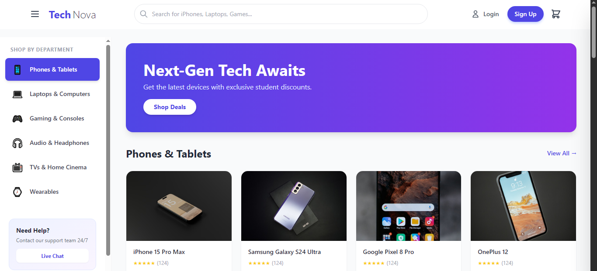

### TechNova - Modern E-Commerce Web App

A fully responsive, interactive, and modern e-commerce front-end application built with React. TechNova simulates a real-world tech shopping platform with a focus on UI/UX, state management, and responsive design.

### 🚀 Features

 Modern UI/UX: Clean, minimalist design with smooth transitions, shadows, and hover effects.

### Fully Responsive:
Desktop: Sticky sidebar and multi-column product grids.
Mobile: Hamburger menu with slide-out drawer and single-column grid.

### Interactive Components:
Cart Drawer: Slide-out cart panel to view items, subtotal, and remove products.
Auth Modal: Unified Login/Sign-up modal with form switching.
Sticky Header: Header changes style on scroll for better navigation context.
Dynamic Product Display: Products are rendered dynamically based on category data with real-time "Add to Cart" updates.
Optimized Assets: Uses high-quality image sources with compression parameters for fast loading.

### 🛠️ Tech Stack
React.js (Functional Components & Hooks)
Tailwind CSS (Utility-first CSS Framework)
Lucide React / Heroicons (SVG Icons)
JavaScript ES6+

### 📁 Project Structure
src/├── components/│   ├── Header.jsx          # Navigation, Search, Cart/Account triggers│   ├── SidebarMenu.jsx     # Category navigation (Drawer on mobile)│   ├── ProductGrid.jsx     # Product cards and "Add to Cart" logic│   ├── Footer.jsx          # Links and Newsletter│   ├── CartDrawer.jsx      # Slide-out cart panel│   └── AuthModal.jsx       # Login / Signup overlay├── data/│   └── products.js         # Categories & Products Data Source├── pages/│   └── Home.jsx            # Main layout controller (State Management)├── App.jsx├── index.css└── main.jsx

### 🏃‍♂️ Getting Started
Follow these instructions to get a copy of the project up and running on your local machine.

### Prerequisites
Node.js (v14 or later)
npm or yarn
Installation

### Clone the repository
bash

git clone https://github.com/MCCREARY25/technova-ecommerce.git
cd technova-ecommerce

# Install dependencies
npm install

# Start the development server
npm run dev

Open your browser and navigate to http://localhost:5173 (or the port shown in your terminal).

### 💡 Usage & Customization
Changing Product Data
All product data is centralized in src/data/products.js.

### To add a new category:

Add a new object to the categories array.
Add a corresponding key in productsData with an array of product objects.
Example:

javascript

// In data/products.js
export const categories = [
  // ...existing categories
  { id: "cameras", name: "Cameras & Drones", icon: "📷" },
];

export const productsData = {
  // ...existing data
  cameras: [
    { id: "c1", name: "Sony Alpha A7", price: 1999, image: "your-image-url" },
  ],
};

#  Styling
This project uses Tailwind CSS. You can modify the tailwind.config.js file to change the color palette (e.g., changing the primary indigo to blue or purple).

# 📦 Dependencies
The project relies on the following core packages (usually installed by default in Vite/React setups):

react
react-dom
tailwindcss
 
 ### 📄 License
Distributed under the MIT License. See LICENSE for more information.